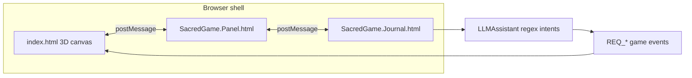

# Sacred Adventures — codebase study summary

This document captures how the repository is organized and how the hybrid adventure experience fits together technically.

## Mission

Freeware, accessibility-minded adventure blending **first-person exploration**, **top-down / village-map style navigation**, and an **old-journal–style UI** with **text-driven intent** (typed commands routed through a small “game master” layer). The main [index.html](../index.html) meta explicitly frames WCAG AAA and offline/PWA play.

## Two parallel “engines” in one repo

| Track | Entry | Role |
|--------|--------|------|
| **Production / full game** | [index.html](../index.html) | Loads Three.js via import map, injects classic scripts (`Component.*`, `js/*`), registers a service worker ([sw.js](../sw.js)), boots the full experience. |
| **v2 modular baseline** | [index.v2.html](../index.v2.html) | ES-module boot: [js/v2/Orchestrator.js](../js/v2/Orchestrator.js) owns renderer/scene/camera, registers pluggable modules ([js/v2/World.js](../js/v2/World.js), [js/v2/UIModule.js](../js/v2/UIModule.js)), benchmarks FPS per module. Comments in `index.v2.html` reserve future modules (Trees, NPCs, Journal, etc.). |

Recent work on the v2 track typically touches Orchestrator, World (terrain + `WorldPhysics`), and UIModule (PIP / moondial-style overlay).

## Hybrid FPV + top-down + adventure UI

- **FPV vs map**: [js/EngineMain.js](../js/EngineMain.js) handles `TOGGLE_VIEW_MODE`, toggling `window._isMapView` and swapping which camera feeds the main renderer; a dedicated map camera (`_nativeMapCam`) looks down at the player. Movement respects map mode in [js/engine/EngineMovement.js](../js/engine/EngineMovement.js) (yaw-based direction when `_isMapView`).
- **PIP swap**: PIP click can flip **“FPV in PIP / map main”** vs the inverse (`_swapModes` in EngineMain), reducing heavy passes when the logbook overlay is open.
- **Panel shell**: [SacredGame.Panel.html](../SacredGame.Panel.html) is the rich HUD wrapper (fonts, Lucide, layers, z-index tokens). It coordinates with the 3D page via **`postMessage`**.
- **Journal**: [SacredGame.Journal.html](../SacredGame.Journal.html) is a **self-contained iframe-oriented journal** that communicates **only through `postMessage`**. Book content often lives in [Component.NewJournal.html](../Component.NewJournal.html) (WCAG-oriented styling appears there and in WordPress copies).

## “LLM journal” in code terms

[js/Component.LLMAssistant.js](../js/Component.LLMAssistant.js) is a **local intent router**: regex patterns on logbook input dispatch structured events (`REQ_START_AUTO_WALK`, `REQ_FIND_HER_AUTOWALK`, etc.) via `postMessage` to the parent panel or `window.postMessage`. That matches an **“old journal + typed commands”** feel; remote model APIs are not required for this path (naming suggests room for richer AI later).

## Accessibility and audience

- [index.html](../index.html) meta describes Indigenous children’s learning, **WCAG AAA**, offline play.
- Journal/panel HTML/CSS includes **large touch targets, focus visibility, live regions** (see `Component.NewJournal.html` and panel variants).
- **Offline-first**: local [vendor/three/](../vendor/three/) in the root game; [index.v2.html](../index.v2.html) uses the same pattern.

## Other folders (scope control)

- **`WORDPRESS/`**, **`dist/`**, **`SacredOnes.1/`**, **`_legacy_archive/`**: mirrors, builds, or older snapshots — useful for history, not always the canonical live paths next to root [index.html](../index.html).

## Suggested reading order for a deeper dive

1. [index.html](../index.html) — script injection order and canvas/container layout  
2. [js/EngineMain.js](../js/EngineMain.js) — scene loop, camera modes, PIP, message handling  
3. [SacredGame.Panel.html](../SacredGame.Panel.html) + [SacredGame.Journal.html](../SacredGame.Journal.html) — UI composition and messaging  
4. [js/Component.LLMAssistant.js](../js/Component.LLMAssistant.js) — text → game events  
5. [index.v2.html](../index.v2.html) + [js/v2/Orchestrator.js](../js/v2/Orchestrator.js) — future modular direction  

---

## Next focus areas (pick one or combine)

These three tracks are the natural follow-ups after this overview. Choose based on whether you are rebuilding performance-first (`v2`), shipping features in the current shell (`production`), or hardening inclusion (`a11y`).

### A. v2 module roadmap (incremental engine)

- Register new modules in [index.v2.html](../index.v2.html) after implementing `{ name, load, unload, update }` against [Orchestrator](../js/v2/Orchestrator.js)’s contract.
- Reuse [World](../js/v2/World.js)’s `window.WorldPhysics` for anything that needs terrain collision.
- Mirror production behaviors (trees, NPCs, journal) as thin modules so each can be benchmarked in isolation.

### B. Production EngineMain / journal integration

- Trace `postMessage` types between [SacredGame.Panel.html](../SacredGame.Panel.html), journal iframes, and [EngineMain.js](../js/EngineMain.js); keep payloads backward-compatible when adding events.
- Extend [Component.LLMAssistant.js](../js/Component.LLMAssistant.js) intents alongside any new `REQ_*` handlers in the engine/panel.
- When changing camera or PIP logic, retest `_isMapView`, `_swapModes`, and panel iframe notifications together.

### C. Accessibility audit (quick checklist)

- Verify WCAG AAA claims against live contrast and touch-target measurements on [Component.NewJournal.html](../Component.NewJournal.html) and the panel shell.
- Exercise keyboard-only paths for journal open/close, focus order, and visible focus rings.
- Confirm screen reader announcements via ARIA live regions in the panel/journal stack during game events (quests, errors, loading).
